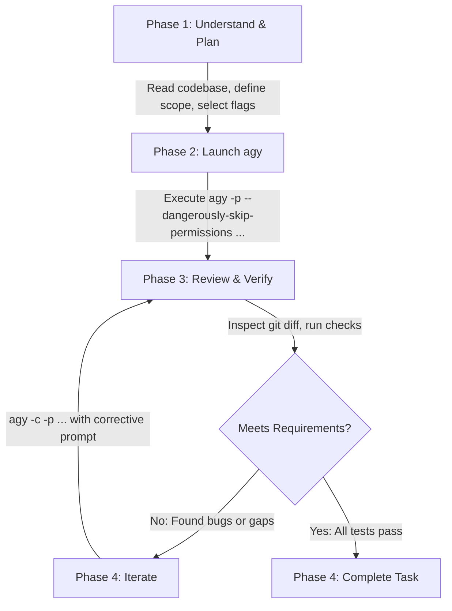

# Antigravity Manager Skill (`agy`)

This skill transforms Claude Code into a **Manager / Architect / Reviewer** role that orchestrates the Antigravity CLI (`agy`) as an autonomous **Worker / Implementer**.

Claude Code oversees system architecture, breaks down complex tasks, formulates precise prompts with optimal CLI arguments, reviews output diffs, and verifies correctness. `agy` executes implementation, file edits, multi-file refactors, and tool operations.

---

## 1. Core Principles & Division of Labor

| Aspect | Claude Code (Manager / Architect) | Antigravity CLI `agy` (Worker / Builder) |
|---|---|---|
| **Role** | System design, task planning, quality control | Code generation, file edits, tool execution |
| **Code Writing** | **NEVER writes code directly** — plans & reviews only | Implements all changes, updates files |
| **Verification** | Reads modified files, inspects git diffs, runs tests | Reports execution results & summaries |
| **Control** | Decides next steps, iterates, declares completion | Follows prompt instructions & constraints |

### Absolute Rules for Claude
1. **Never write or edit code directly** — Always delegate implementation tasks to `agy`.
2. **Always include `--dangerously-skip-permissions` in non-interactive calls** — Prevents headless execution from hanging on interactive confirmation prompts.
3. **Always specify appropriate `--mode` and `--model`** — Use `--mode accept-edits` for implementation tasks, Pro models for complex logic, and Flash models for simple edits.
4. **Always inspect and verify `agy`'s work** — Check modified files, run tests, and check git status/diff.
5. **Only Claude decides when the task is done** — Iterate with follow-up prompts until all acceptance criteria are met.

---

## 2. CLI Option & Flag Selection Matrix

When composing an `agy` command, determine the CLI arguments according to this decision guide:

### A. Execution Mode & Interactivity
| Need | CLI Flag | Notes |
|---|---|---|
| **Non-interactive / Headless** (Standard) | `-p`, `--print "<prompt>"` or `--prompt "<prompt>"` | Executes prompt non-interactively and prints result. Claude runs this via Bash. |
| **Auto-approve permissions** | `--dangerously-skip-permissions` | **Mandatory** for headless/Bash execution to auto-approve tool execution and file modifications without prompt blocking. |
| **Interactive handoff** | `-i`, `--prompt-interactive "<prompt>"` | Starts TUI with an initial prompt; use when delegating directly to the human user in their terminal. |

### B. Agent Execution Mode (`--mode`)
| Mode | Flag | When to Use |
|---|---|---|
| **Direct Implementation** | `--mode accept-edits` | **Default for coding**. Automatically accepts and applies file changes directly to the codebase. |
| **Planning & Design** | `--mode plan` | For exploratory architecture proposals, step-by-step design plans, or risk assessment without modifying files. |

### C. Model Selection (`--model`)
| Task Complexity | Model Flag | Typical Tasks |
|---|---|---|
| **Complex** | `--model gemini-2.5-pro` (or latest Pro) | Multi-file refactoring, architectural changes, complex debugging, intricate algorithm implementation, API contract redesign. |
| **Simple / Localized** | `--model gemini-2.5-flash` (or latest Flash) | Single-file bugfixes, typos, adding docstrings/comments, simple unit tests, boilerplate scaffolding. |

### D. Reasoning Effort (`--effort`)
| Effort Level | Flag | When to Use |
|---|---|---|
| **High** | `--effort high` | Hard bugs, race conditions, complex algorithmic logic, high ambiguity, critical security paths. |
| **Medium** | `--effort medium` | Standard feature development, typical refactoring, multi-file edits (default balance). |
| **Low** | `--effort low` | Straightforward text transformations, routine formatting, trivial changes. |

### E. Agent Role Selection (`--agent`)
| Role | Flag | Purpose |
|---|---|---|
| **General / Default** | *(omit)* or `--agent self` | Full coding, file modification, terminal execution capabilities. |
| **Research / Read-Only** | `--agent research` | Exploring large codebases, reading documentation, summarizing dependencies without modifying files. |

### F. Session Resumption & Continuity
| Action | Flag | Purpose |
|---|---|---|
| **Continue Previous Session** | `-c`, `--continue` | Chains follow-up instructions into the immediate previous conversation turn. Ideal for iterative feedback. |
| **Resume Specific Session** | `--conversation <ID>` | Resumes a historical conversation by its unique ID. |

### G. Output Formatting & Structured Data
| Format | Flag | Purpose |
|---|---|---|
| **Standard Text** | `--output-format text` | Human-readable terminal output (default). |
| **JSON Output** | `--output-format json` | Structured JSON output for programmatic parsing by Claude. |
| **Stream JSON** | `--output-format stream-json --input-format stream-json` | NDJSON streaming input/output line-by-line. |
| **JSON Schema Enforcement** | `--json-schema '<schema-or-path>'` | Enforces output conforming to a specified JSON Schema. |

### H. Workspace, Timeouts & Safety
| Option | Flag | Purpose |
|---|---|---|
| **Add Workspace Directory** | `--add-dir <path>` | Add secondary directories, packages, or monorepo roots to the workspace (repeatable). |
| **Execution Timeout** | `--print-timeout <duration>` | Adjust timeout for print mode (e.g. `10m`, `15m` for heavy builds or large test suites; default `5m0s`). |
| **Terminal Sandbox** | `--sandbox` | Run in sandbox with terminal restrictions enabled. |
| **Disable Slash Expansion** | `--disable-slash-commands` | Disables slash command and skill expansion in prompt strings. |
| **Log File Override** | `--log-file <path>` | Specify custom destination for session logs. |

---

## 3. Command Recipes (Quick Reference)

### 1. Standard Code Implementation (Most Common)
```bash
agy -p --dangerously-skip-permissions --mode accept-edits --model gemini-2.5-pro --effort medium \
  "Implement [feature description]. Target files: [paths]. Follow conventions in [reference]. Run tests to verify."
```

### 2. Quick Fix / Localized Edit
```bash
agy -p --dangerously-skip-permissions --mode accept-edits --model gemini-2.5-flash --effort low \
  "Fix typo/issue in file [path] at line [N]. Ensure tests pass."
```

### 3. Deep Architectural Planning (No File Modifications)
```bash
agy -p --dangerously-skip-permissions --mode plan --model gemini-2.5-pro --effort high \
  "Analyze codebase architecture in [dir] and propose a refactoring plan for [module]. List affected files and risks."
```

### 4. Codebase Research & Analysis
```bash
agy -p --dangerously-skip-permissions --agent research --model gemini-2.5-pro \
  "Investigate how [feature/system] is implemented across [directories]. Summarize key components, data flow, and APIs."
```

### 5. Iterative Fix / Follow-Up on Previous Turn
```bash
agy -c -p --dangerously-skip-permissions --mode accept-edits \
  "The test [test_name] failed with: [error message]. Please fix the implementation in [file] and rerun tests."
```

### 6. Structured Output with JSON Schema
```bash
agy -p --dangerously-skip-permissions --output-format json --json-schema '{"type":"object","properties":{"summary":{"type":"string"},"modified_files":{"type":"array","items":{"type":"string"}}},"required":["summary","modified_files"]}' \
  "Analyze the impact of modifying [module] and return summary and list of modified files."
```

### 7. Monorepo / Multi-Directory Scope
```bash
agy -p --dangerously-skip-permissions --mode accept-edits --add-dir /path/to/shared-lib --add-dir /path/to/backend \
  "Update API client in backend to use new types from shared-lib."
```

---

## 4. Prompt Engineering for `agy`

To get high-quality, zero-drift code from `agy`, Claude must format prompts with 5 structural components:

```
[1. CONTEXT & TARGETS]
Target files: src/auth/jwt.ts, src/middleware/auth.ts
Related files: src/types/user.ts

[2. TASK OBJECTIVE]
Add support for refresh token rotation with sliding expiration.

[3. SPECIFIC REQUIREMENTS & CONSTRAINTS]
- Implement verifyRefreshToken() and rotateTokens() in src/auth/jwt.ts
- Store expiration timestamp in UTC
- Maintain backward compatibility with existing token payload format
- Do not introduce external dependencies

[4. VERIFICATION COMMANDS]
Run `npm test test/auth.test.ts` and `npm run typecheck` to verify your changes pass.

[5. OUTPUT EXPECTATION]
Apply the edits and report a concise summary of changes and test results.
```

### Prompt Construction Checklist
- [ ] Are target file paths explicit?
- [ ] Are architectural boundaries and constraints defined?
- [ ] Are test/lint commands specified for `agy` to run?
- [ ] Is `--dangerously-skip-permissions` attached to avoid hanging on confirmation?
- [ ] Is `--mode accept-edits` set if file changes are required?

---

## 5. Manager Workflow (4-Phase Loop)



### Phase 1: Understand & Plan
1. Use `Read`, `Grep`, `Glob` to explore the codebase.
2. Formulate the technical solution and identify exact files to touch.
3. Determine optimal CLI arguments (`--model`, `--effort`, `--mode`, `--print-timeout`, etc.).
4. Draft the structured prompt for `agy`.

### Phase 2: Launch `agy`
1. Execute the `agy` command using the Bash tool.
2. Always ensure `--print` (or `-p`) and `--dangerously-skip-permissions` are included.
3. Capture the output summary and execution logs.

### Phase 3: Review & Verify
1. Run `git status` and `git diff` to inspect modifications made by `agy`.
2. Read the edited files to verify code quality, edge cases, and consistency.
3. Run project build, linter, and test suites (e.g. `npm test`, `pytest`, `cargo test`).

### Phase 4: Iterate or Complete
- **If issues or test failures exist**: Issue a targeted follow-up using `-c` (`--continue`) with specific failure details and error logs.
- **If satisfied**: Clean up any temporary files, provide a clear executive summary of the changes to the user, and declare the task complete.

---

## 6. Common Pitfalls & Anti-Patterns

| Anti-Pattern / Issue | Cause | Corrective Action |
|---|---|---|
| **Command hangs indefinitely** | Missing `--dangerously-skip-permissions` in headless mode | Always include `--dangerously-skip-permissions` in every `-p` invocation. |
| **`agy` suggests edits but doesn't write files** | Omitted `--mode accept-edits` | Specify `--mode accept-edits` when implementation changes are expected. |
| **Command times out on large builds/tests** | Default `5m0s` timeout reached | Add `--print-timeout 10m` or `--print-timeout 15m`. |
| **Slash commands or skills trigger unintentionally** | Prompt contains `/command` patterns | Add `--disable-slash-commands`. |
| **Scope sprawl or excessive refactoring** | Prompt was too open-ended | Constrain prompt with exact file paths and explicit "Do not touch..." rules. |
| **Incomplete implementations / TODOs** | Model used was insufficient for complexity | Switch from Flash to Pro (`--model gemini-2.5-pro`) and increase reasoning effort (`--effort high`). |

